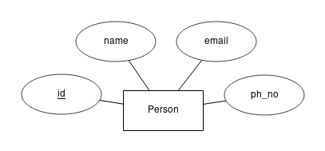
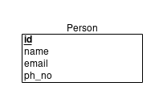
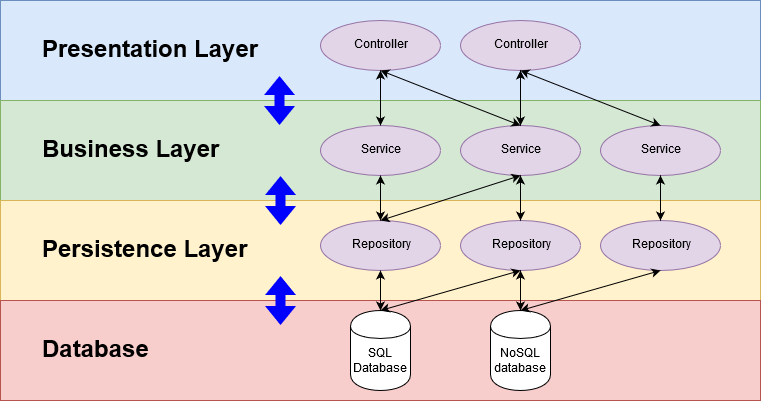

# Introduction to Hibernate (Entity Creation, Without Relationship)
## Abstract
> You have to use **Hibernate** when we want to make CRUD operations in relational database server using Java code.
> If you have _NEVER_ done a project with the basic connectivity between **Java and MySQL Server**, I suggest you learning [this](https://www.javatpoint.com/example-to-connect-to-the-mysql-database) first.

## About
- [X] CRUD with Hibernate
- [X] Insert data using Hibernate
- [X] Fetch data using Hibernate
- [X] Update data using Hibernate
- [X] Delete data using Hibernate
- [ ] ON DELETE SET NULL
- [ ] ON DELETE CASCADE

## What is Hibernate?
- [About Hibernate ORM](https://hibernate.org/orm/)
- Hibernate ORM (Hibernate in short) is an object-relational mapping tool for the Java programming language. It provides a framework for mapping an object-oriented domain model to a relational databases like Oracle, MySQL, MS SQL, etc. Hibernate also provides data query and retrieval facilities.
- Hibernate provides transparent persistence for Plain Old Java Objects (POJOs). The only strict requirement for a persistent class is a no-argument constructor, though not necessarily (public) because the function of DTO still stands.
- Hibernate provides HQL query i.e., same query for every relational database server.

# What is DAO?
- DAO(Data Access Object) is the relationship between SQL Server and Java Object. It fetches the data from database and store it in Java Object.

# What is DTO?
- DTO looks the same an Entity. But its job is to carry the data. DTO(Data Transfer Object) is the carrier of data of an object. In Hibernate, when we get a method from dao, **Session** of Hibernate is closed and lead to LazyInitializationException. So basically, DTO saves and use to transfer data of DAO.

## Setting up the project
- Press Alt+Shift+N and create _Maven Project_.
- Add the following dependencies in pom.xml.
```
<!-- https://mvnrepository.com/artifact/org.hibernate/hibernate-entitymanager -->
<dependency>
    <groupId>org.hibernate</groupId>
    <artifactId>hibernate-entitymanager</artifactId>
    <version>5.4.7.Final</version>
</dependency>
	
<!-- https://mvnrepository.com/artifact/mysql/mysql-connector-java -->
<dependency>
    <groupId>mysql</groupId>
    <artifactId>mysql-connector-java</artifactId>
    <version>8.0.18</version>
</dependency>
```
- Add [hibernate.cfg.xml](https://docs.jboss.org/hibernate/orm/3.3/reference/en/html/session-configuration.html) under src/main/java
- If you didn't add
```
"<property name="hibernate.hbm2ddl.auto">update</property>"
```
in hibernate.cfg.xml, Hibernate won't generate the table in your relational database server. But you can write SQL query and create it yourself.
- If you change its value to "create", Hibernate will drop the table and create a new table whenever you run the program.
- With HibernateUtils, get the connection between your database server and Java.

## Diagrams
- ER Diagram

- Relational Schema

- SQL Query
<pre>
CREATE TABLE person(
	id INT AUTO_INCREMENT NOT NULL,
	name VARCHAR(50),
	email VARCHAR(50),
	ph_no VARCHAR(20),
	PRIMARY KEY (id)
);
</pre>

## Java POJO for above diagrams
- Hibernate will create table in database server with the following POJO. Pretty Easy, right?
```
public class Person {
	private Long id;
	private String name;
	private String email;
	private String ph_no;
	
	//getters and setters
}
```
- But We're not done yet! We need to signals the Hibernate with the following annotations.
```
@Entity
@Table(name="person")
public class Person {
	@Id
	@GenerateValue(strategy=GenerationType.IDENTITY)
	private Long id;
	
	@Column(name="name");
	private String name;
	
	@Column(name="email");
	private String email;
	
	@Column(name="ph_no");
	private String phNo;
}
```

## Explanation of Annotations
- **@Entity**
  - To signals Hibernate that this is an Entity.
- **@Table(name="custom_name")**
  - To signals Hibernate that this is the table. If you only use **@Table**, Hibernate will automatically set the name with the name of the Java Class but will lowercase characaters i.e., "person."
  - **More with @Table annotation**
    - **@UniqueConstraint** is used when the columns cannot have duplicate values. Or you can set it in **@Column(unique=true)** and default is false.
```
@Table(name = "person", uniqueConstraints = {
		@UniqueConstraint(
				columnNames = {"id", "email", "ph_no"}
		)
})
```
- **@Id**
  - To signals Hibernate that this is an ID.
  - Use data type Long rather than Integer. because of
     - Integer = (−32,767 to +32,767) range. 16 bits in size.
     - Long = (−2,147,483,647 to +2,147,483,647) range. 32 bits in size.
- **@GenerateValue(strategy=GenerationType.IDENTITY)**
  - To signals Hibernate that this ID will auto increment its value.
- **@Column(name="custom_name")**
  - To signals Hibernate that this is a column.
  - **More with @Column annotation**
    - unique (default=false)
    - updatable (default=true)
    - nullable (default=true)
    - length (default=255)
    - [precision](https://stackoverflow.com/questions/4078559/how-to-specify-doubles-precision-on-hibernate)
    - [columnDefinition](https://stackoverflow.com/questions/16078681/what-properties-does-column-columndefinition-make-redundant)
    - [scale](https://stackoverflow.com/questions/4078559/how-to-specify-doubles-precision-on-hibernate)

## Application Layering
- Application Layering is a good practice. Every layer has its own responsibility. It also gives the design loose coupling(Less Interdependency, Less Coodination, Less information Flow) and easier to understand the whole design when working with team. It doesn't need to be the Java Project. It could be PHP or .Net or etc. But we used this flow to make an understandable design for the project. When you're working with a team, if the code is only understandable for you, then it's not working work. In short, the code must be understandable for everybody in your team. That's the most important part.
- According to my experience, if you're a beginner, your code is understandable for you for a week or a month. But after 2 or 3 months, it's completely lost from your memory. Why? Because there's no logic. Machine understands the machine but what's important is your code must be understandable by human. After you've got familiar with Design Patterns, SOLID principles, Architecture and Application Layering, your project is understandable after you read it again in many years. That's exactly why you should use this logic.
- You might be thinking that there are too many classes and packages. It's very complex! No!!! no!! no!!! Once you've understand it, it's the easiest way to remember your project for eternity.


- **Controller** 
  - controllers the View and Model. It transfer the further processing to **Service.**
- **Service**
  - is the employee of the **Controller**. It has to do where the **Controller** tells it to do and it transfers the data to the persistance layer using DTO Object.
- **Repository** 
  - is used to receive the data from DTO object through **Service**. And then give it to DAO to perform CRUD to the database. 
- **Database**
  - provides connections for the **Repository** and is the actual connection between the _Actual Database Server and JAVA._

## Electronics Engineer-cum-J2EE Backend Developer ##
-  Created by - Aye Chan Aung Thwin
